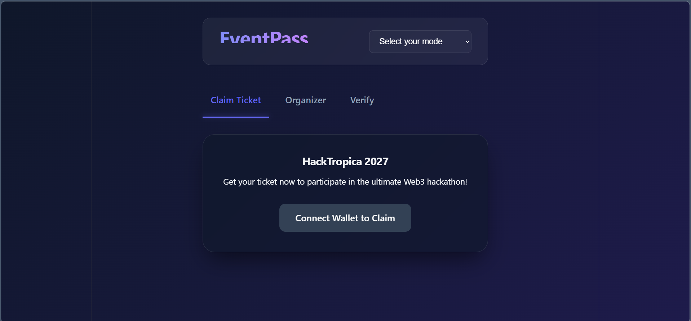
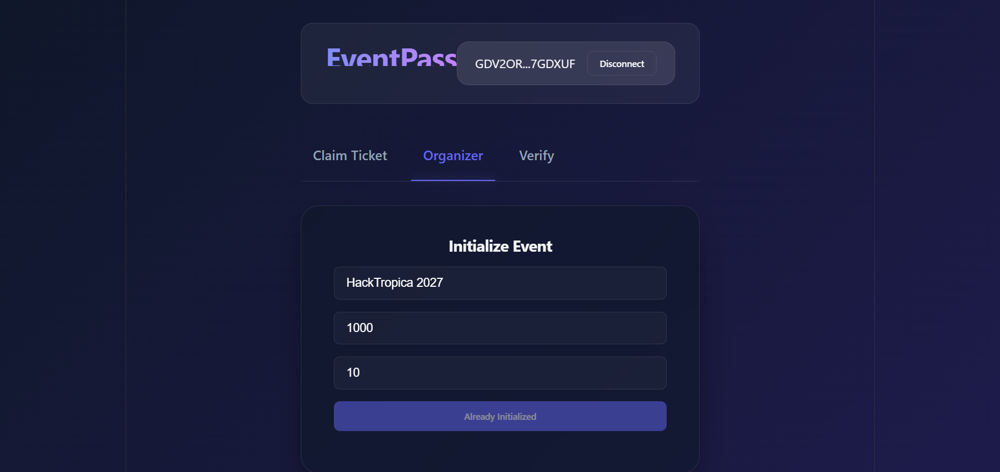
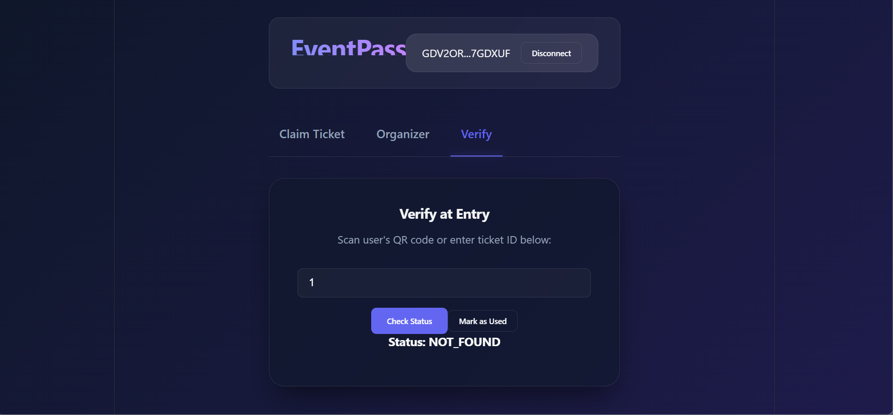
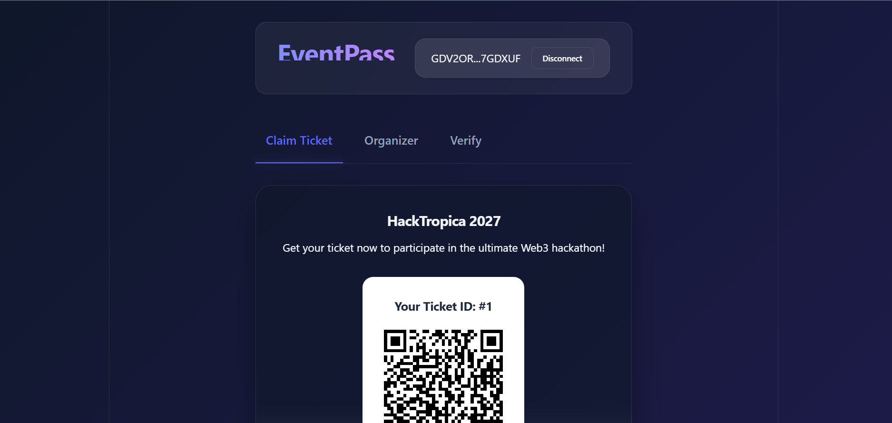

# Event Pass 🎫

Event Pass is a decentralized ticketing platform built on **Stellar Soroban**, **React**, and **FastAPI**. It allows event organizers to seamlessly deploy on-chain tickets with fixed capacities and prices, and enables users to claim their tickets and generate QR codes for on-site verification.

### 🌐 Live Demo
Check out the deployed frontend here: [https://event-pass-lac.vercel.app/](https://event-pass-lac.vercel.app/)

## 🚀 Features

- **Organizer Dashboard:** Easily initialize an event with a set ticket limit and price (in XLM or Custom Assets).
- **Claim Tickets:** Users can connect their Freighter wallet, pay the ticket price, and instantly mint an on-chain event ticket.
- **QR Code Verification:** A unique QR code is generated upon claiming the ticket, enabling frictionless on-site check-ins.
- **FastAPI Backend Sync:** A high-performance Python backend caches blockchain state in a PostgreSQL database for lightning-fast reads and verification.
- **Verify & Mark as Used:** Organizers can verify ticket validity rapidly via the backend API and mark them as used directly on the blockchain, preventing double-spending or counterfeit tickets.
- **Wallet Integration:** Built-in seamless support for the **Freighter Wallet**.

---

## 📸 Screenshots

Here are some previews of the Event Pass interface:

| Welcome / Connect Wallet | Organizer Dashboard |
| ------------------------ | ------------------- |
|  |  |

| Claim Ticket | Verify Ticket |
| ------------ | ------------- |
|  |  |

---

## 🏗️ Architecture

This project is structured as a monorepo containing the smart contract, the frontend application, and the backend caching layer:

- `/contracts`: The Rust-based Soroban smart contract.
- `/backend`: The FastAPI Python backend utilizing NeonDB (PostgreSQL) to sync and serve ticket metadata.
- `/frontend`: The React.js (Vite + TypeScript) user interface.

---

## 💻 Developer Setup

Follow these instructions to get the project up and running on your local machine for development and testing.

### Prerequisites

1. **Rust & Cargo**: [Install Rust](https://www.rust-lang.org/tools/install)
2. **Soroban CLI**: Install the Soroban CLI for Stellar smart contract development.
   ```bash
   cargo install --locked soroban-cli
   ```
3. **Node.js**: (v18+ recommended)
4. **Python 3.11+**: For running the FastAPI backend.
5. **Freighter Wallet**: Install the [Freighter browser extension](https://www.freighter.app/) and enable "Testnet" mode.

### 1. Smart Contract Development (`/contracts`)

Navigate to the contracts directory:
```bash
cd contracts
```

#### Build the Contract
```bash
soroban contract build
```

#### Run Tests
```bash
cargo test
```

### 2. Backend Setup (`/backend`)

Navigate to the backend directory:
```bash
cd backend
```

#### Install Dependencies
```bash
python -m venv venv
# Windows
.\venv\Scripts\activate
# Mac/Linux
source venv/bin/activate

pip install -r requirements.txt
```

#### Environment Variables
Create a `.env` file in the `/backend` directory and add your PostgreSQL connection string:
```env
DATABASE_URL="postgresql://[user]:[password]@[endpoint_hostname]/[dbname]?sslmode=require"
```

#### Run the Development Server
```bash
uvicorn main:app --reload
```
The API will be available at `http://localhost:8000` (Visit `http://localhost:8000/docs` for the Swagger UI).

### 3. Frontend Setup (`/frontend`)

Navigate to the frontend directory:
```bash
cd frontend
```

#### Install Dependencies
```bash
npm install
```

#### Generate Typescript Bindings (Optional)
If you update and re-deploy the contract, you will need to regenerate the TypeScript bindings.
```bash
soroban contract bindings typescript --network testnet --contract-id <YOUR_CONTRACT_ID> --output-dir ./src/contracts/event_pass
```
*Note: Make sure to navigate to `./src/contracts/event_pass` and run `npm install && npm run build` to compile the newly generated bindings.*

#### Environment Variables
Ensure you have a `.env` file set up in the `/frontend` directory:
```env
VITE_STELLAR_RPC_URL="<YOUR_STELLAR_RPC_URL>"
VITE_PAYMENT_ASSET_ID="<YOUR_PAYMENT_ASSET_ID>"
VITE_CONTRACT_ID="<YOUR_CONTRACT_ID>"
VITE_BACKEND_URL="http://localhost:8000"
```

#### Run the Development Server
```bash
npm run dev
```
The app will be available at `http://localhost:5173`.

---

## 🌐 Deployment

### Deploying the Backend (Render)

1. Push your repository to GitHub.
2. Go to [Render Dashboard](https://render.com/) and create a new **Web Service**.
3. Connect your GitHub repository.
4. Set the **Root Directory** to `backend`.
5. Set the **Build Command** to `pip install -r requirements.txt`.
6. Set the **Start Command** to `uvicorn main:app --host 0.0.0.0 --port $PORT`.
7. Add your `DATABASE_URL` environment variable.
8. Click **Deploy**. Note the deployed URL (e.g., `https://your-backend.onrender.com`).

### Deploying the Frontend (Vercel)

1. Go to [Vercel Dashboard](https://vercel.com/dashboard) and click **Add New Project**.
2. Import your repository.
3. Under **Build and Output Settings**, set the **Root Directory** to `frontend`. The framework preset should automatically be detected as **Vite**.
4. Expand the **Environment Variables** section and add the variables from your `frontend/.env` file, ensuring `VITE_BACKEND_URL` is set to your new Render deployment URL.
5. Click **Deploy**. Your full-stack app is now live!

---

## 🛠️ Built With

- **Smart Contracts**: Rust, Soroban SDK
- **Backend API**: Python, FastAPI, SQLAlchemy, NeonDB (PostgreSQL)
- **Frontend**: React, TypeScript, Vite
- **Wallet Interaction**: `@stellar/freighter-api`, `stellar-sdk`

## 📄 License

This project is open-source and available under the [MIT License](LICENSE).
